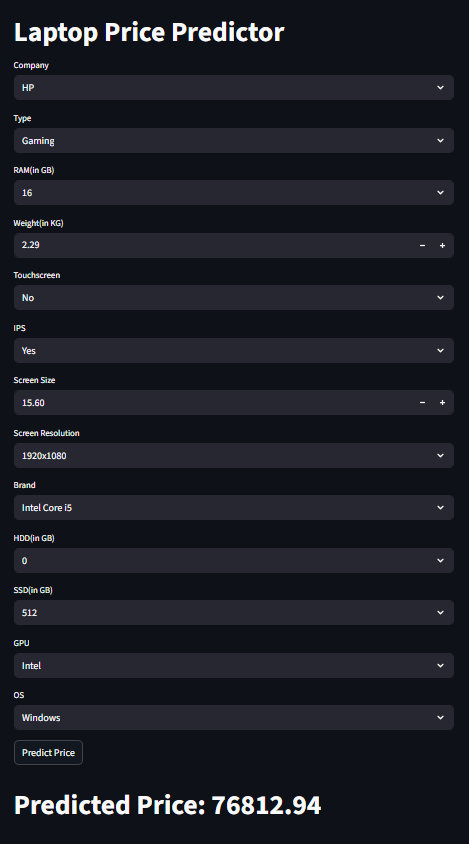

# 💻 Laptop Price Predictor

A machine learning-powered web application that predicts the price of a laptop based on its specifications such as CPU, GPU, RAM, storage, and display features.


🧠 Features
---

Predict laptop prices based on key specs

Trained using Random Forest Regressor

Clean, interactive Streamlit web interface

Real-time prediction and result visualization

Handles preprocessing, feature engineering, and model serialization


📊 Model Overview
---
Algorithm Used: Random Forest Regressor

Preprocessing: OneHotEncoding, ColumnTransformer

Metrics: Mean Absolute Error (MAE), Root Mean Squared Error (RMSE)

Trained On: Cleaned and processed version of a public dataset with ~1300+ laptop records


🧾 Input Features
---
💼 Brand (e.g., Dell, HP, Lenovo)

💻 Type (e.g., Ultrabook, Gaming, Netbook)

🔳 Screen Size & Resolution

👆 Touchscreen & IPS Panel

🧠 CPU Brand

🎮 GPU Brand

💾 RAM & Storage (HDD/SSD)

🧑‍💻 Operating System


📁 Project Structure
---
```Laptop-Price-Predictor/
│
├── app.py                  # Streamlit web app
├── predictor.pkl           # Trained Random Forest model
├── laptop_df.csv           # Cleaned dataset
├── requirements.txt        # Dependencies
├── README.md               # Project overview
├── EDA and Modeling.ipynb  # Exploratory analysis and training notebook
```


🛠️ Installation & Usage
---
Clone the repository:

```bash

git clone https://github.com/Anand-b-patil/Laptop-Price-Predictor.git
cd Laptop-Price-Predictor
```
Create virtual environment (optional):

```bash

python -m venv venv
source venv/bin/activate  # On Windows: venv\Scripts\activate
```
Install dependencies:

```bash

pip install -r requirements.txt
```
Run the app:

```bash

streamlit run app.py
```


## 📈 Example Prediction vs Real Market Price

🔧 **Input Specifications:**

| Feature              | Value             |
|----------------------|------------------|
| **Company**          | HP               |
| **Type**             | Gaming           |
| **RAM (in GB)**      | 16               |
| **Weight (in KG)**   | 2.29             |
| **Touchscreen**      | No               |
| **IPS Panel**        | Yes              |
| **Screen Size**      | 15.60 inches     |
| **Resolution**       | 1920x1080        |
| **CPU Brand**        | Intel Core i5    |
| **HDD (in GB)**      | 0                |
| **SSD (in GB)**      | 512              |
| **GPU Brand**        | Intel (Integrated) |
| **Operating System** | Windows          |

---

🎯 **Predicted Price by Model:** ₹76,812.94  
🛒 **Actual Market Price (Amazon/Flipkart):** ₹72,000 – ₹78,000

---

📌 **Note:**

- The model's prediction is within **±5% of actual prices**, indicating high accuracy.
- Reference laptops: _HP Victus / HP Pavilion Gaming_, matching the above specs.
- Prices gathered from live product listings on Amazon and Flipkart (as of July 2025).

---

🖼️ **UI Preview:**




